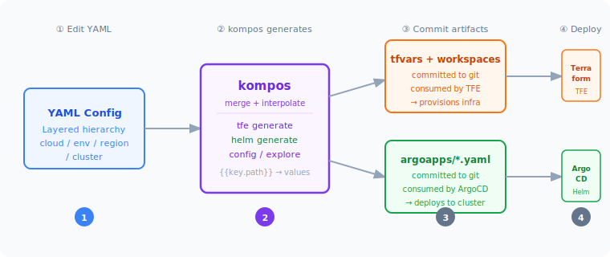

# kompos

[](https://www.travis-ci.com/adobe/kompos) [](https://hub.docker.com/r/adobe/kompos) [](https://microbadger.com/images/adobe/kompos "Get your own version badge on microbadger.com") [](https://github.com/adobe/kompos/blob/master/LICENSE) [](https://pypi.python.org/pypi/kompos/)


**Kompos** is a configuration source management tool for infrastructure platforms. It maintains a Git-based layered
configuration structure that generates environment-specific configurations for Terraform and other infrastructure tools.

**Perfect for:** Multi-environment deployments, cell-based architectures, platform engineering teams managing 10s-100s
of clusters.

**Workflow:** Layered config source in Git → Kompos generates → Commit → Terraform/TFE consumes → Deploy

## Key Features

- **Layered Configuration**: Organize configs by cloud/environment/region/cluster with automatic inheritance and merge
- **Generate Configurations**: Produce tfvars, workspace configs, and composition files for Terraform/TFE
- **Value Interpolation**: Dynamic config resolution with `{{key.path}}` placeholders
- **Configuration Analysis**: Trace value origins, visualize hierarchy, compare environments
- **Extensible Runners**: Built-in Terraform and TFE runners, extensible architecture for custom destinations

### Core Benefits

- ✅ **Version Controlled**: All changes tracked in Git with full audit trail
- ✅ **DRY at Scale**: Define once, inherit everywhere. Start with cluster-specific configs, refactor common patterns
  upward to shared layers
- ✅ **Clear Precedence**: Specific configs override general ones automatically
- ✅ **Environment Variants**: Dev uses latest versions, prod uses stable - same codebase
- ✅ **Effortless Updates**: Change one shared config file → update 50+ clusters instantly
- ✅ **Clean Separation**: Source configs vs generated artifacts

Below is a graphical representation of the data flow, showing how hierarchical
configurations are merged and interpolated before being injected into runners:



## Installation

**Requirements:** Python 3.11 or higher

### PyPI (Recommended for Users)

```bash
# Install
pip install kompos

# Upgrade to latest version
pip install --upgrade kompos
```

### Using Virtual Environment (Recommended)

Using virtualenv for isolated installation:

```bash
pip install virtualenv
virtualenv kompos-env
source kompos-env/bin/activate
(kompos-env) pip install kompos
(kompos-env) pip install --upgrade kompos
(kompos-env) kompos --version
```

### Locally for Development

Using virtualenv with editable install:

```bash
pip install virtualenv
virtualenv .env
source .env/bin/activate
(env) cd kompos/
(env) pip install --editable .
```

## Documentation

- **[📖 Quick Guide](./docs/GUIDE.md)** - Get started in 5 minutes
- **[📚 Advanced Guide](./docs/ADVANCED.md)** - Architecture, runners, debugging, best practices
- **[💡 Examples](./examples/)** - Hands-on tutorials (beginner to advanced)
- **[🧪 Testing](./tests/README.md)** - Run tests and add new ones

## Testing

```bash
# Quick tests (no dependencies)
python tests/run_tests.py

# Comprehensive tests (requires pytest)
pip install pytest pyyaml
pytest tests/ -v
```

See [tests/README.md](./tests/README.md) for details.

## Layered Configuration

Kompos leverages [himl](https://github.com/adobe/himl) to provide a layered configuration structure as your **Git-based
source of truth**. Configuration files are organized hierarchically and automatically merged based on directory paths,
enabling powerful inheritance patterns.

**How it works:** Base configurations are defined at higher levels (e.g., cloud, region) and automatically inherited by
more specific levels (e.g., cell, cluster), with the ability to override any value at any level.

**Ideal for cell-based architectures:** Define shared cell configuration once (networking, security, compliance), then
override per-cell specifics (capacity, module versions, feature flags). One config change can update an entire cell
deployment pattern.

**The DRY workflow:**

1. **Start specific** - Define per-cluster configs as you build
2. **Spot patterns** - Notice repeated values across clusters
3. **Refactor upward** - Move common config to shared layers (region → env → cloud)
4. **Override when needed** - Keep only differences at cluster level

**Example:** All clusters use `terraform_version: "1.5.0"` → Move to `cloud=aws/defaults.yaml` → One change updates
everything.

This enables:

- **Git-Based Workflow**: Config changes via PRs → Generate → Terraform/TFE consumes
- **Config Inheritance**: Define once at base level, override only what differs
- **Value Interpolation**: Reference values with `{{key.path}}` syntax
- **Artifact Generation**: Produce tfvars, compositions, workspace configs for downstream tools
- **Config Analysis**: Trace origins, visualize hierarchy, compare environments
- **Scale**: Manage 50+ clusters from a handful of config files

## Examples

Comprehensive examples are available in [`examples/`](./examples/) with a progressive learning path:

1. **[Layered Configuration](./examples/01-hierarchical-config/)** - Learn configuration inheritance and merge behavior
2. **[Module Version Pinning](./examples/02-module-version-pinning/)** - Dynamic Terraform module versioning with
   `.tf.versioned` files
3. **[Config Exploration](./examples/03-config-exploration/)** - Analyze and visualize configuration hierarchies
4. **[TFE Multi-Cluster](./examples/04-tfe-multi-cluster/)** - Terraform Enterprise workspace and composition generation

See the [Examples README](./examples/README.md) for a complete guide with difficulty levels, time estimates, and
learning paths.

## Usage

Generate configuration artifacts from layered config source for infrastructure tools:

```bash
# TFE: Generate workspace configs, tfvars, and compositions (primary)
kompos <config_path> tfe generate

# Terraform: Generate configs and run Terraform locally
kompos <config_path> terraform <command>

# Explore: Analyze config hierarchy and trace values
kompos <config_path> explore <analyze|trace|visualize|compare>

# Config: View merged configuration
kompos <config_path> config --format yaml
```

**Workflow:** Generate configs → Commit → Terraform/TFE consumes → Deploy

**Note:** helmfile runner is deprecated. For Kubernetes, use GitOps tools (ArgoCD/Flux) or the planned helm runner.

### Common Config Commands

The `config` command supports all HIML arguments natively for flexible configuration viewing and debugging:

```bash
# Example path from hierarchical example
CONFIG_PATH="examples/01-hierarchical-config/config/cloud=aws/env=dev/cluster=cluster1/composition=terraform/terraform=cluster"

# View full merged configuration
kompos $CONFIG_PATH config

# View as JSON
kompos $CONFIG_PATH config --format json

# Filter: show only specific keys
kompos $CONFIG_PATH config --filter cluster --filter vpc

# Exclude: hide specific keys
kompos $CONFIG_PATH config --exclude terraform --exclude composition

# Save to file
kompos $CONFIG_PATH config --output-file merged-config.yaml

# Wrap output under a key (useful for Terraform)
kompos $CONFIG_PATH config --enclosing-key config

# Skip interpolation validation (useful for templates with missing values)
kompos $CONFIG_PATH config --skip-interpolation-validation

# Skip secret resolution (faster for debugging)
kompos $CONFIG_PATH config --skip-secrets

# Combine multiple options
kompos $CONFIG_PATH config \
  --filter cluster --filter vpc \
  --format json \
  --output-file cluster-vpc.json \
  --skip-secrets
```

**Tip:** Use `--filter` to inspect specific sections of your configuration during development and debugging.

## Docker Image

Docker images are not currently maintained. Please use PyPI installation for the latest version.
Docker image [adobe/kompos](https://hub.docker.com/r/adobe/kompos)

## License

[Apache License 2.0](/LICENSE)
