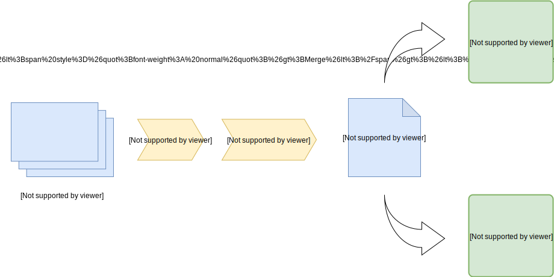

# kompos
[](https://www.travis-ci.com/adobe/kompos) [](https://hub.docker.com/r/adobe/kompos) [](https://microbadger.com/images/adobe/kompos "Get your own version badge on microbadger.com") [](https://github.com/adobe/kompos/blob/master/LICENSE) [](https://pypi.python.org/pypi/kompos/)


**Kompos** is a configuration driven tool for provisioning and managing
Kubernetes infrastructure across AWS and Azure. It uses a hierarchical folder
structure and yaml files to store and generate configurations, with pluggable
compositions that encapsulates the infrastructure code and state. Terraform and
helmfile are supported as provisioners.

Below is a graphical representation of the data flow.



## Installation

_**NOTE**: Only Python 3 is supported._

### PyPI 

```bash
pip install kompos
```

### Locally for development

Using virtualenv

```bash
pip install virtualenv
virtualenv .env
source .env/bin/activate
(env) cd kompos/
(env) pip install --editable .
```

## Hierarchical configuration

Kompos leverages [himl](https://github.com/adobe/himl) to provide a
[hiera](https://puppet.com/docs/puppet/latest/hiera_intro.html#concept-7256)-like
configuration structure.

Checkout the [examples](./examples) for more information.

## Nix integration

With kompos you can leverage [nix](https://nixos.org/nix/) to pin your
infrastructure code (i.e terraform & helmfile releases) on a specific version.
This enables you to finely control your deployments and use different
infrastructure versions per environment, cluster etc.

#### Prerequisites

Install `nix` and `nix-prefetch-git`.

```bash
$ curl https://nixos.org/nix/install | sh

# It's used to automatically derive the commit sha & the hash of the repo,
# in case those are not provided by the configuration.
$ nix-env -f '<nixpkgs>' -iA nix-prefetch-git
```

#### Configuration

Use the integration with the `--nix` flag with each command. Below are the
necessary parts of komposconfig regarding nix & versioning:

```yaml
terraform:
  # This is the place to look for the terraform repo locally.
  # Used as the default if nix is not enabled. 
  local_path: '/home/user/terraform-stack'

  # This is needed in case the modules are not in the root of the repo.
  root_path: 'src/terraform'

  repo:
    # This will be the name of the nix derivation for terraform.
    name: 'terraform-stack'

    # The repo we would like to version.
    url:  "git@github.com:my-org/terraform-stack.git"

# Likewise for helmfile.
helmfile:
  local_path: '/home/user/helmfile-releases'
  root_path: 'src/helmfiles'

  repo:
    name: 'helmfile-releases'
    url:  "git@github.com:my-org/helmfile-releases.git"
```

And in the hierarchical configuration you'll need the following keys:

```yaml
infrastructure:
  terraform:
    version: "0.1.0" # A git tag or a commit sha.

    # This is an optional field.
    # The sha256 hash of the repo provides data integrity and ensures that we
    # always get the same input. 
    # 
    # It can be omitted when you're using a tag that is periodically updated. 
    # (e.g in a dev/nightly environment). Since this is a mandatory field for nix, 
    # nix-prefetch-git will be used as a fallback to caclulate it.
    sha256: "ab9190b0ecc8060a54f1fac7de606e6b2c4757c227f2ce529668eb145d9a9516"

  # Likewise for helmfile.
  helmfile:
    version: "0.1.0"
    sha256: "139cd5119d398d06f6535f42d775986a683a90e16ce129a5fb7f48870613a1a5"
```

### Docker Image


## License
[Apache License 2.0](/LICENSE)
